# Procurement Security Demo

A Flask-based procurement and vendor workflow demo that combines a CRM-style interface with enterprise security controls, billing-aware marketplace fulfillment, and lifecycle webhook simulation. It is designed to showcase secure vendor ingress, DLP, risk governance, encrypted transport selection, Azure/AWS fulfillment, and pay-as-you-go usage metering in a single presentation-ready application.

## What this application does

This project demonstrates a secure enterprise procurement flow across several layers:

- Vendor payload verification using Ed25519 signatures
- Strict schema validation with Pydantic
- DLP-style anonymization for sensitive fields
- Agent authorization tokens and scoped execution permissions
- Human approval gates for high-risk transactions
- Audit ledger and signed execution receipts
- Risk scoring and blast-radius governance
- Azure and AWS marketplace onboarding simulation
- Lifecycle webhook handling for subscription changes and cancellations
- Usage metering patterns for marketplace billing
- Prometheus-style telemetry dashboards and charting
- SQLite-backed CRM and sales workflow data
- Constrained AI agents for vendor parsing, anomaly detection, and audit summarization
- Full regression test coverage validating both the security layer and the agent layer

## Main application files

- `app.py` — Flask web app and API routes
- `VendorPayloadVerification.py` — security, governance, crypto, lifecycle, fulfillment, billing, and agent logic
- `templates/demo.html` — live demo UI
- `templates/index.html` — landing page
- `requirements.txt` — Python dependencies
- `crm.db` — SQLite database generated at runtime
- `test_vendor_security.py` — regression tests for security, governance, agents, and marketplace flows
- `README.md` — project overview and secure AI design guidance

## Tech stack

- Python 3.10+
- Flask
- SQLite
- Pydantic
- cryptography
- requests
- boto3 (optional, for AWS marketplace integration pattern)

## Installation

1. Open a terminal in the project folder.
2. Create a virtual environment (optional but recommended):

```bash
python -m venv .venv
```

3. Activate the environment:

Windows PowerShell:
```powershell
.\.venv\Scripts\Activate.ps1
```

Windows CMD:
```cmd
.venv\Scripts\activate.bat
```

Linux/macOS:
```bash
source .venv/bin/activate
```

4. Install dependencies:

```bash
pip install -r requirements.txt
```

## Run the app

From the project root:

```bash
python app.py
```

Then open:

- http://127.0.0.1:5000/
- http://127.0.0.1:5000/demo


### 1. Vendor Document Parsing & Data Structuring Agent

This agent is now implemented as `VendorDocumentParsingAgent`.

- Role: parse unstructured vendor inputs such as PDFs, emails, legacy EDI text, and supplier notes.
- Output: strict JSON-like dictionaries that can be validated against Pydantic models before insertion into the system.
- Safety model: the agent converts untrusted vendor text into structured data only; it does not directly execute vendor actions.
- Value: reduces manual data entry while ensuring every downstream payload passes schema enforcement and cryptographic signing checks.

### 2. Threat & Anomaly Detection Agent

This agent is now implemented as `ThreatDetectionAgent`.

- Role: monitor vendor behavior, multi-agent execution logs, and out-of-pattern operational signals.
- Signals: unusual spikes in request volume, anomalous inventory updates, suspicious tool access, or out-of-scope API action attempts.
- Safety model: it emits risk observations and alert states, but does not approve actions by itself.
- Value: gives security teams behavioral monitoring beyond static rules, and works alongside the blast-radius governance engine already in this project.

### 3. Plain-English Compliance & Audit Summarizer

This agent is now implemented as `ComplianceAuditAgent`.

- Role: convert signed hash logs and structured governance data into readable audit summaries for legal, compliance, and executive stakeholders.
- Inputs: cryptographically verified ledger entries, receipts, and policy decisions.
- Safety model: the agent reads only sanitized, signed, and already-approved evidence. It is not allowed to alter records or issue decisions.
- Value: enables natural-language audit queries and executive summaries while preserving traceability back to the source logs.

In short, this application follows a zero-trust AI design:

- raw vendor data is never trusted
- LLMs are constrained to parsing, detection, and summarization
- schema validation, cryptographic verification, audit logging, and human approval remain the enforcement layer

## System architecture

```mermaid
flowchart LR
    A[Third-Party Vendor Input\nInvoice / PDF / Email / JSON] --> B[Untrusted Vendor Stream]
    B --> C[LLM Parsing Agent\nConvert to strict JSON]
    C --> D[Pydantic Validation\nSchema Enforcement]
    D --> E[Cryptographic Signature Check]
    E --> F[Risk / Blast-Radius Governance]
    F --> G{Risk Level}
    G -->|Low| H[Auto-execute Approved Actions]
    G -->|Medium| I[Multi-Agent Consensus]
    G -->|High| J[Human Approval Gate]

    H --> K[Marketplace Fulfillment\nAzure / AWS]
    I --> K
    J --> K

    K --> L[Signed Audit Ledger\nExecution Receipts]
    L --> M[Compliance & Audit Summarizer]
    L --> N[Threat & Anomaly Detection Agent]
    N --> O[Security Dashboard / SOC Alerts]
    M --> P[Executive Audit Q&A]

    classDef secure fill:#d9f2e6,stroke:#2e7d32,color:#000;
    classDef warn fill:#fff4cc,stroke:#b7791f,color:#000;
    classDef risky fill:#fdecea,stroke:#c62828,color:#000;

    class A,B,C,D,E,F,H,I,J,K,L,M,N,O,P secure;
    class G warn;
    class J risky;
```



This architecture keeps the LLM in a constrained role: it can parse, detect anomalies, and summarize evidence, but it does not directly approve a high-risk transaction or act on untrusted vendor instructions without validation and human oversight.

## Demo features

### CRM and sales dashboard

The app includes a lightweight CRM-style workflow with:

- users
- contacts
- leads
- opportunities
- sales pipeline stages

These are stored in SQLite and exposed through JSON API routes such as:

- `/api/users`
- `/api/contacts`
- `/api/leads`
- `/api/opportunities`

### Secure vendor ingest

The app demonstrates a zero-trust procurement flow with:

- vendor signature validation
- payload schema enforcement
- risk scoring for payment volume and access tier
- approval requirements for high-risk actions
- audit entries for execution receipts

### Encryption strategy demo

The system can dynamically route to different cryptographic strategies:

- AES-256-GCM
- ChaCha20-Poly1305
- Fernet

This is exposed via the vendor strategy summary and the cryptographic engine in `VendorPayloadVerification.py`.

### Marketplace fulfillment

The app includes onboarding workflows for:

- AWS marketplace registration
- Azure marketplace registration

Routes include:

- `/marketplace/aws/onboard`
- `/marketplace/azure/onboard`

### Lifecycle events and metering

The app can process lifecycle events such as:

- cancel/unsubscribe
- plan changes
- renewals
- subscription updates

It also supports usage metering for both platforms:

- `/marketplace/webhooks`
- `/marketplace/usage-meter`
- `/marketplace/usage-meter/aws`
- `/marketplace/usage-meter/azure`

These are implemented to follow marketplace-style usage reporting patterns and can fall back to local simulated billing when external services are not configured.

### Prometheus-style telemetry

The app exposes a metrics simulation layer with sample time series covering:

- pipeline throughput
- security audits
- agent performance
- gateway latency
- HTTP 5xx rate
- CPU usage
- memory usage

Routes include:

- `/api/prometheus-demo`
- `/api/prometheus/query_range`

## Testing

Run the full regression suite:

```bash
python -m unittest discover -v
```

This validates the core security, governance, agent behavior, fulfillment, telemetry, and usage-metering flows.

### Current validation status

The project currently passes the complete regression suite with 17 tests covering:

- vendor signature verification
- payload tampering detection
- schema validation
- human approval flow
- agent authorization checks
- encryption round trips
- DLP sanitization
- signed receipt verification
- Prometheus query responses
- marketplace onboarding
- lifecycle webhooks
- usage metering
- document parsing agent
- anomaly detection agent
- compliance summarization agent

## Example security flow

A typical secure vendor ingestion flow looks like this:

1. Vendor sends signed supply payload.
2. Payload is validated cryptographically.
3. Schema is checked for structural correctness.
4. Sensitive data is sanitized.
5. Risk score is computed.
6. High-risk actions require human approval.
7. Audit receipt is written.
8. Marketplace tenant is provisioned or usage is recorded.

## Shipping readiness notes

Before publishing to GitHub, the project should be initialized as a git repository and a `.gitignore` should be added to exclude:

- `.venv/`
- `__pycache__/`
- `.env`
- `crm.db`
- generated logs and local cache directories

The codebase has been reviewed for obvious secret-like values and no live AWS or Azure credentials were found in the repository content itself. The system uses environment variables and placeholder/mock values for marketplace tokens where appropriate.

## Notes

- This is a demo application intended for presentation, training, and workflow validation.
- Real AWS/Azure marketplace calls require valid credentials and environment configuration.
- The app is intentionally built to illustrate secure enterprise procurement and billing patterns without requiring a production cloud deployment.

## Suggested next steps

- Add real authentication and session management
- Replace mock marketplace credentials with environment-based secrets
- Add persistent tenant and usage records in a production database
- Expand the UI into a more formal operations console
- Hook Prometheus or a monitoring backend into real telemetry data

## License

This project is provided as a demonstration application for internal and educational use.
